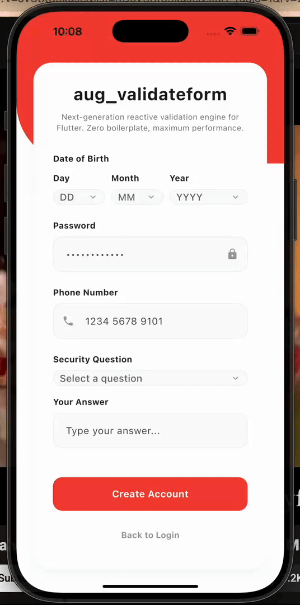

# aug_validateform

[](https://pub.dev/packages/aug_validateform)
[](https://opensource.org/licenses/MIT)
[](https://github.com/umarKhan1/aug_validateform/actions)

`aug_validateform` is a zero-boilerplate, type-safe validation engine that 
weaves logic directly into your models using the 2026 stable Mixin pattern. 
Unlike traditional form builders, it preserves your pure data models while 
providing reactive `ValueNotifier` feedback with zero reflective overhead.

---

### 🛠 Reactive Validation in Action


---

## 🚀 The Problem & The 2026 Solution

In modern Flutter development, complex forms often lead to a "Maintenance 
Nightmare." `aug_validateform` solves this by moving logic out of the UI 
and into a generated, high-performance validation layer.

| Feature | The "Legacy" Reality | The `aug_validateform` Way |
| :--- | :--- | :--- |
| **Type Safety** | String-keyed maps or dynamic fields | Fully type-safe model signatures |
| **State Management** | Manual `setState` or controller hacks | Auto-generated `ValueNotifier` state |
| **Boilerplate** | 50+ lines of validator logic in UI | High-density field annotations |
| **Performance** | Runtime reflection or heavy wrappers | Native Mixin "injection" (Wasm-Ready) |

---

## 🛠 Architectural Transparency

How does it work? Instead of wrapping your objects or using slow reflection, 
`aug_validateform` uses Dart's `part`/`part of` mechanism combined with 
Code Generation. 

When you run `build_runner`, we "weave" a generated validation mixin directly 
into your data class. This creates a tight, **Impeller-ready** validation loop.
Because it avoids reflection entirely, it's 100% **Wasm-compatible**, making 
it the highest-performing validation suite for Flutter Web in 2026.

---

## 🚀 Quick Start

### Step 1: `pubspec.yaml` Setup
Add the core and the generator to your project:

```yaml
dependencies:
  aug_validateform: latest_version

dev_dependencies:
  aug_validateform_generator: latest_version
  build_runner: ^2.4.0
```

### Step 2: Define Your Validation Model
Annotate your class and "weave" the validation logic in using a mixin.

```dart
import 'package:aug_validateform/aug_validateform.dart';
import 'package:flutter/foundation.dart';

part 'user_form.validate.dart';

@Validatable()
class UserForm with _$UserFormValidation {
  @Required(message: "Email is required")
  @Email()
  String email = "";

  @Required()
  @MinLength(8)
  @UpperCase()
  @Digit()
  @SpecialChar()
  String password = "";

  @Match('password', message: "Passwords do not match")
  String confirmPassword = "";
}
```

### Step 3: Run the Engine
Generate the performance-optimized code:

```bash
dart run build_runner build --delete-conflicting-outputs
```

### Step 4: Reactive UI Integration
Observe errors with surgically precise rebuilds using `ValidationWatcher`.

```dart
ValidationWatcher(
  notifier: form.validationNotifier,
  fieldName: 'email',
  builder: (context, error) => TextFormField(
    onChanged: (v) => form.email = v,
    decoration: InputDecoration(
      labelText: 'Email Address',
      errorText: error,
    ),
  ),
);
```

---

## 🛠 Validator Reference

Our validator suite is built for the security and format requirements of 2026.

| Annotation | Description | Parameters |
| :--- | :--- | :--- |
| `@Required` | Checks for null or empty strings | `message` |
| `@Email` | Validates standard email formats | `message` |
| `@Phone` | Validates international phone formats | `message` |
| `@Alphanumeric`| Letters and numbers only | `message` |
| `@UpperCase` | Requires at least one capital letter | `message` |
| `@LowerCase` | Requires at least one small letter | `message` |
| `@Digit` | Requires at least one numerical digit | `message` |
| `@SpecialChar` | Requires at least one symbol | `message` |
| `@MinLength` | Enforces minimum string length | `length`, `message` |
| `@MaxLength` | Enforces maximum string length | `length`, `message` |
| `@Match` | Cross-field comparison logic | `fieldName`, `message` |
| `@Combined...` | Logical OR (Email or Phone) | `message` |

---

## 🤝 Community & Contributing

We welcome contributions! If you find a bug or have a feature request, please 
open an issue on our [GitHub repository](https://github.com/umarKhan1/aug_validateform).

### Meet the Author
Developed and maintained by **Muhammad Omar**.
- **LinkedIn**: [muhammad-omar-0335](https://www.linkedin.com/in/muhammad-omar-0335/)
- **GitHub**: [umarKhan1](https://github.com/umarKhan1)

---

## 📜 License

This project is licensed under the MIT License - see the `LICENSE` file for details.
